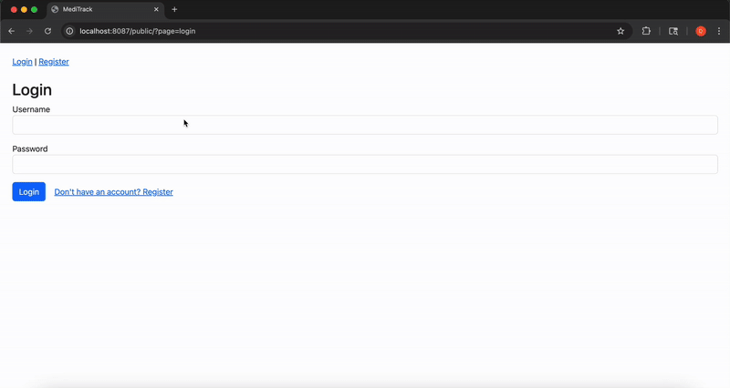

# MediTrack 💊

**MediTrack** is a simple, full-stack PHP application for managing a pharmacy's medicine inventory, orders, and users. Built to demonstrate CRUD operations, SQL queries, role-based access, and basic reporting — all with a clean Bootstrap UI.

## 🌟 Features

### 👤 User Roles

- **Admin**: Full control over medicines, users, and order management
- **Customer**: Browse and place medicine orders

### 🛠 Admin Capabilities

- Add/Edit/Delete medicines
- View and manage all orders
- Update order statuses (Pending, Processing, Shipped, Completed)
- Manage customer accounts
- View basic reports & analytics (top sellers, low inventory, total sales)

### 📊 Reporting (SQL Skills)

- Sales summary (total sold per medicine)
- Low stock alerts (stock < 10 units)
- Top 5 best-selling medicines (quantity sold)

### 🧪 Technologies Used

- PHP (Vanilla, procedural)
- MySQL (w/ prepared statements)
- Bootstrap (CDN)
- No frameworks, no Composer — simple and portable

## 🖥 Demo Preview



## 🚀 Getting Started

### Requirements

- PHP 8+
- MySQL
- Local server (e.g. XAMPP, MAMP, Laravel Valet)

### Installation

1. Clone the repo:

   ```bash
   git clone https://github.com/your-username/MediTrack.git
   ```

2. Import the database:

```
   * Create a MySQL database named `meditrack`
   * Import the provided SQL dump (if available)
```

3. Set DB credentials in `/includes/db.php`

4. Run it locally by navigating to the `public/` folder in your browser:

   ```
   http://localhost/MediTrack/public/index.php
   ```

### Admin Login

> Default admin login :

```
Username: admin1
Password: admin123
```

## 📁 Project Structure

```
.
├── assets/              # CSS / Bootstrap
├── includes/            # DB connection
├── public/              # Front controller + actions
├── views/               # UI pages (login, orders, admin panels, reports)
```

## ✅ What This Project Demonstrates

- CRUD operations (medicines, orders, users)
- Role-based access control
- Real-world SQL usage (joins, aggregates, conditions)
- Admin reporting/dashboard
- Bootstrap layout without JS frameworks

## 🧠 Bonus Ideas

- Add Composer & PSR-4 autoloading
- Export reports to CSV
- Search/filter in admin tables
- Add Stripe for payments

---

**Built for practice and to showcase full-stack PHP fundamentals.**
